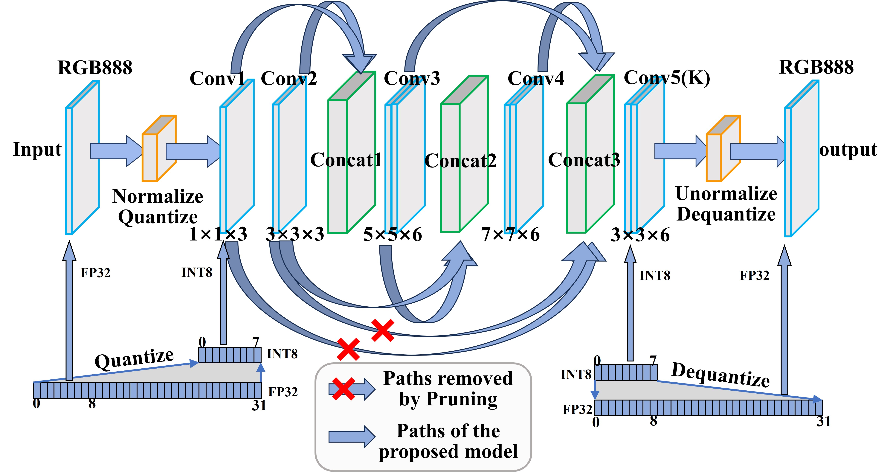
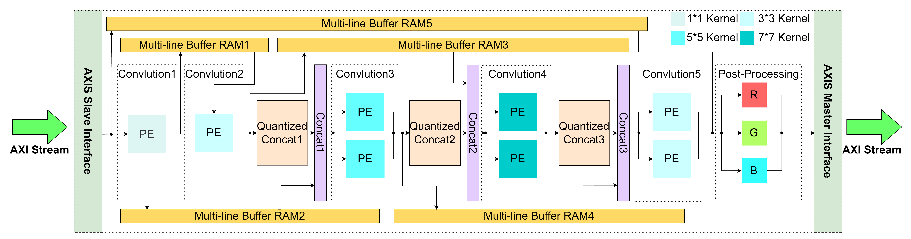

[【2023年全国大学生FPGA创新设计大赛】国一作品——基于PYNQ的去雾神经网络加速器](https://www.bilibili.com/video/BV1oN411V7Ex/?share_source=copy_web&vd_source=eaba837283b4b7c5bb95d722558383de)
AOD_net_numpy_v1为软件代码
EEAOD-Net为硬件系统工程
论文[An energy-efficient dehazing neural network accelerator based on E2AOD-Net](https://link.springer.com/article/10.1007/s11554-024-01574-x)

硬件系统和PYNQ官方文件的[下载地址](https://pan.quark.cn/s/4c4810b5c640)(夸克网盘)